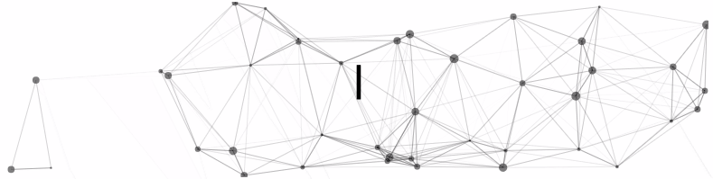

  

## Who Am I

I'm a first year undergrad pursuing Computer Science with Data Science specialization at Monash University 🏛. I love to explore modern technologies and leverage them to solve real-life problems ✨. I'm currently into Web Development 🕸️ and working on learning machines 🤓.

## 🧑‍🚀 Github Stats

  
  

## ☄️ Github Streaks

  

## ⚡ Recent Activity

<!--START_SECTION:activity-->
1. 🎉 Merged PR [#1](https://github.com/weichunnn/growthlog/pull/1) in [weichunnn/growthlog](https://github.com/weichunnn/growthlog)
2. 💪 Opened PR [#1](https://github.com/weichunnn/growthlog/pull/1) in [weichunnn/growthlog](https://github.com/weichunnn/growthlog)
3. ❌ Closed PR [#102](https://github.com/MUM-Open-Source/eureka-web-app/pull/102) in [MUM-Open-Source/eureka-web-app](https://github.com/MUM-Open-Source/eureka-web-app)
4. 💪 Opened PR [#103](https://github.com/MUM-Open-Source/eureka-web-app/pull/103) in [MUM-Open-Source/eureka-web-app](https://github.com/MUM-Open-Source/eureka-web-app)
5. 💪 Opened PR [#102](https://github.com/MUM-Open-Source/eureka-web-app/pull/102) in [MUM-Open-Source/eureka-web-app](https://github.com/MUM-Open-Source/eureka-web-app)
<!--END_SECTION:activity-->

## Cool things inside this ReadME :)

- TypeIt, ParticleJS and VueJS for Intro -> [CodeSandBox](https://codesandbox.io/s/readme-intro-7hhv5)
- Github Metrics from [Github ReadMe Stats](https://github.com/anuraghazra/github-readme-stats)
- Github Streaks from [Github ReadMe Streak Stats](https://github.com/DenverCoder1/github-readme-streak-stats)
- GitHub Activity Actions from [GitHub Activity ReadMe](https://github.com/jamesgeorge007/github-activity-readme)
